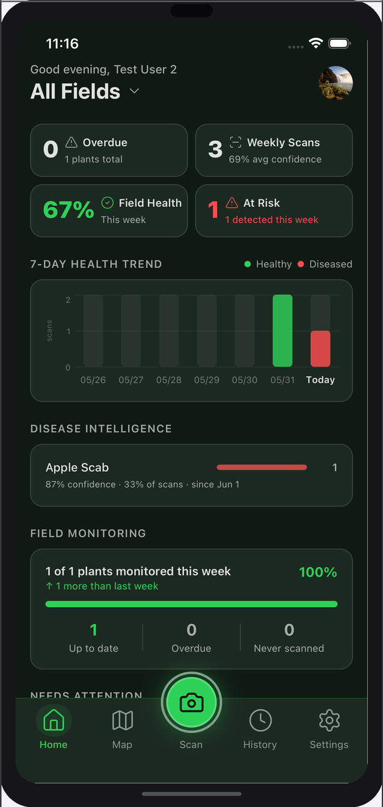
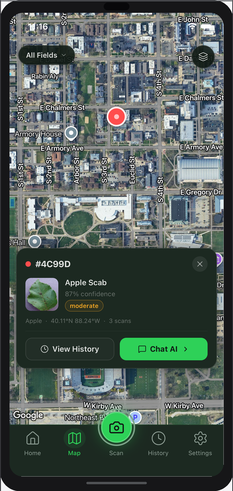
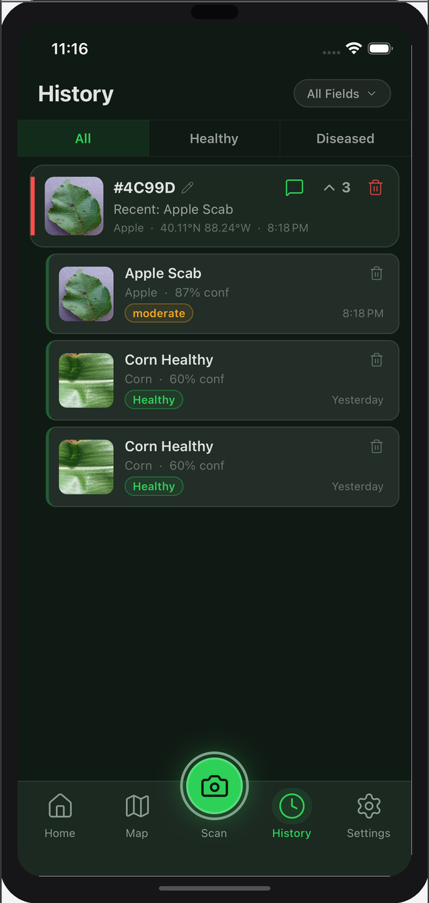
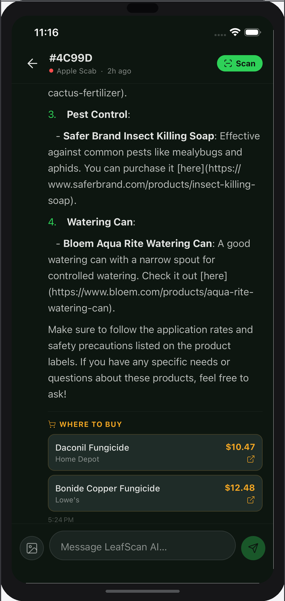

# LeafScan

Scan a fruit leaf with your phone, get a disease diagnosis, then ask an AI agronomist for effective, natural remedies.

**[▶ Live Demo](https://appetize.io/app/b_bcuxan5s6shhj6stu2osaj3kj4)** · **[Live API](https://leafscan-api-1due.onrender.com)** · **[Interactive Docs](https://leafscan-api-1due.onrender.com/docs)** · **[Setup Guide](docs/setup.md)** · **[API Reference](docs/api.md)**

> The free-tier server cold-starts in ~30 s after inactivity.

---

| Dashboard | Scan | History | Crop Advisor |
|:---------:|:----:|:-------:|:------------:|
|  |  |  |  |

---

## What it does

**Scan** — Camera or photo library → EfficientNet-B0 inference → disease name, severity, and treatment list in under 1 s. Scans are stored with a signed Supabase Storage URL and linked to a plant record.

**Field Map** — Google Maps hybrid view with color-coded pins (green = healthy, red = diseased). Tap a pin for a slide-up panel showing the latest scan photo, confidence score, and severity.

**History** — Paginated scan log per plant. Plants can be renamed inline with server-side uniqueness validation.

**Crop Advisor** — Per-plant AI chat backed by GPT-4o-mini + Tavily web search + Serper shopping links. Builds persistent memory across conversations so the model remembers prior observations.

**Drone API** — Any script or drone with an API key can submit scans autonomously. GPS coordinates trigger automatic plant-record creation or matching within a 10 m Haversine radius.

---

## Engineering highlights

**EfficientNet-B0 for inference-per-cost** — ~97% top-1 accuracy on the 38-class PlantVillage benchmark at 5.3 M parameters. Runs in under 200 ms on a Render free instance with no quantization.

**Keyword-gated web search** — A frozenset of 60+ agricultural terms gates Tavily API calls in the chat router. Purely conversational turns skip the search entirely, cutting latency and API cost by ~70%.

**Rolling 24-hour rate limiting without schema changes** — `POST /predict` counts rows in the existing `scans` table filtered by `user_id` and `created_at >= now() - 24h`. No Redis, no extra columns.

**API keys as SHA-256 hashes** — Keys are prefixed `lscan_` and generated with `secrets.token_hex(32)` (256 bits of entropy). Only the hash lands in the database; the raw key is shown exactly once at creation.

**Per-plant AI memory** — After each session, a second lightweight GPT-4o-mini call (capped at 200 tokens) extracts 1–3 observations and writes to a `plant_memories` table. Future sessions prepend these facts to system prompt.

**Security boundary: anon key on mobile, service role on server** — The mobile bundle ships only the Supabase anon key. Every DB write is enforced by Row Level Security. The service role key lives in backend env vars.

---

## Architecture

```
┌──────────────────────────────────────┐
│        Mobile App (Expo/RN)          │
│  expo-router · Supabase anon key     │
│  Row Level Security on all reads     │
└────────────┬─────────────────────────┘
             │  Bearer JWT
             ▼
┌──────────────────────────────────────┐
│      FastAPI  (Docker → Render)      │
│                                      │
│  /predict     EfficientNet-B0        │
│  /chat        GPT-4o-mini + search   │
│  /drone/scan  API-key auth, GPS      │
│  /history     paginated scan log     │
│  /api-keys    key lifecycle CRUD     │
└──────┬──────────┬──────────┬─────────┘
       │          │          │
       ▼          ▼          ▼
  Supabase    Tavily      OpenAI / Serper
  Postgres    Search      GPT-4o-mini +
  + Storage   (grounded   shopping links
  (RLS)        answers)
```

